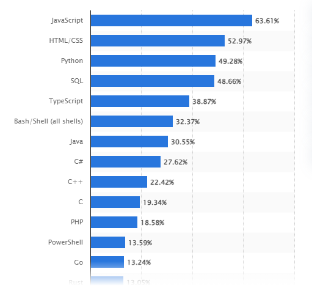

# Why code, and why choose Python as your coding language?

According to survey done in June 2023 of programmers across the world, Python ranked third in popularity amongst other programming languages, just behind Javascript and HTML/CSS.

- Out of approximately 90 thousand participants, 49% said that they used Python for work.

Source: Statista, Lionel Sujay Vailshery

So why use python?

1) **Readability and coherence**: If you have experience with other programming languages, you'll notice that Python's syntax is very intuitive to type and easy to read. If you have never experienced other languages, it is fair to say that Python has some of the easiest syntax which makes it's learning curve much more practical to tackle.

2) **Productivity**: You can accomplish more work with less lines of code in Python. Although python code is slower to execute on the whole, smart programmers know how to navigate and optimize their code. Overall, python is interpreted, meaning that the time consuming process of going into your terminal and writing commands to first link and then run your code are now automatically done for you behind the scenes. Just hit run and it runs!

3) **Portability**: Python is OS independent. The python code you type on your PC can run on a phone, a mac, or a Linux machine all without any changes to the script itself.

4) **LIBRARIES**!!: Libraries are (in my opinion) the bread and butter to activate programs that accomplish a lot in very little code. Python has several prebuilt libraries that support extremely versatile functionalities and goals. You can also install libraries from online onto your local machine for anything your heart desires!

5) **Integration**: Python is sometimes called a scripting language, which means that it can be used to communicate between various programs and components of your computer as a sort of intermeadiary. We can write scripts in Python that interlink C and C++ (other languages) libraries and practically use any I/O on the machine.

6) **Enjoyment**: Python makes it easy to code, even if you don't know what you're doing, even if you don't adhere to best practices. Of course you should do these things, but if you ever want to simply waffle about and experiment, Python has rules but those rules are flexible and robust enough to accomodate for user incompetence or wackiness.

Some downsides of python are simply:

- It is slower to execute for large scale projects (much slower with unoptimized user code)

- It evolves rapidly year to year, update to update. So its hard to keep up with the latest and greatest.

- It is hard to control the minutae of everything on your computer without experience. Even if your code works, you cannot predict the performance of your code or improve it without significant study and practice.

